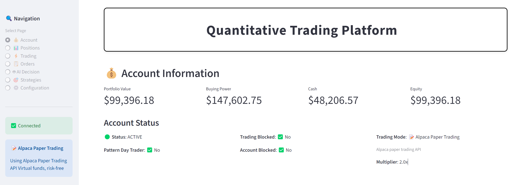

# Alpaca Quantitative Trading Platform

An AI-powered quantitative trading platform for US stocks using Alpaca Markets API and DeepSeek LLM for intelligent trading decisions.

## 📹 Project Demo

Watch the demo video to see the platform in action:

[](
https://youtu.be/-yE2kslwVh4)


## 🚀 Features

### Core Functionality

- **💰 Account Management** - Real-time account information, portfolio value, buying power, and equity tracking
- **📊 Position Management** - View all positions with real-time P&L, entry prices, and market values
- **⚡ Order Management** - Place buy/sell orders with multiple order types (market, limit, stop, stop-limit)
- **🤖 AI Trading Decisions** - DeepSeek LLM-powered analysis providing buy/sell/hold recommendations with confidence scores
- **🎯 Strategy Management** - Create, manage, and execute trading strategies with automated monitoring
- **🔄 Auto Trading** - Automated trading execution based on AI decisions and strategy rules
- **🛡️ Risk Management** - Stop loss and take profit monitoring with automatic alerts
- **📋 Trade Records** - Complete history of all trades and trading signals
- **⚙️ Configuration** - Easy web-based configuration for API keys and trading settings

### Trading Modes

1. **🎮 Local Simulator** (Default)
   - No API required, works out of the box
   - Initial capital: $100,000
   - Completely virtual, risk-free for testing
   - Perfect for learning and strategy development

2. **📝 Alpaca Paper Trading**
   - Uses Alpaca Paper Trading API
   - Virtual money, real market conditions
   - Test strategies with realistic market data
   - Requires Alpaca account (free)

3. **💵 Live Trading**
   - Real money, real orders
   - Full Alpaca Markets integration
   - Use with caution - real financial risk

## 📋 Requirements

- Python 3.8+ (recommended 3.12)
- Stable internet connection
- DeepSeek API Key (for AI features)
- Alpaca API Key (optional, for paper/live trading)

## 🔧 Installation

### 1. Clone the Repository

```bash
git clone <repository-url>
cd aiagents-stock
```

### 2. Create Virtual Environment

```bash
# Windows (PowerShell)
python -m venv venv
.\venv\Scripts\Activate.ps1

# Linux/macOS
python -m venv venv
source venv/bin/activate
```

### 3. Install Dependencies

```bash
pip install -r requirements.txt
```

### 4. Configure Environment

Copy the example environment file:

```bash
# Windows (PowerShell)
Copy-Item env_example.txt .env

# Linux/macOS
cp env_example.txt .env
```

Edit `.env` file and configure your API keys:

```env
# DeepSeek API (Required for AI features)
DEEPSEEK_API_KEY=your_deepseek_api_key_here
DEEPSEEK_BASE_URL=https://api.deepseek.com/v1

# Alpaca API (Optional, for paper/live trading)
ALPACA_ENABLED=false
ALPACA_API_KEY=your_alpaca_api_key_here
ALPACA_API_SECRET=your_alpaca_api_secret_here
ALPACA_PAPER=true  # true for paper trading, false for live trading
```

### 5. Run the Application

```bash
# Using the run script
python run.py

# Or directly with Streamlit
streamlit run app.py --server.port 8503
```

### 6. Access the Web Interface

Open your browser and navigate to: **http://localhost:8503**

## 🐳 Docker Deployment

### Using Docker Compose (Recommended)

```bash
docker-compose up -d
```

### Using Dockerfile

```bash
# Build the image
docker build -t alpaca-trading-platform .

# Run the container
docker run -d -p 8503:8501 \
  -v $(pwd)/.env:/app/.env \
  --name alpaca-trading \
  alpaca-trading-platform
```

### Access the Application

Open your browser and navigate to: **http://localhost:8503**

## 📖 Usage Guide

### Getting Started

1. **Configure API Keys**
   - Navigate to "⚙️ Configuration" in the sidebar
   - Enter your DeepSeek API Key (required for AI features)
   - Optionally configure Alpaca API keys for paper/live trading
   - Click "💾 Save All Configuration"

2. **View Account Information**
   - Click "💰 Account" in the sidebar
   - View your portfolio value, buying power, cash, and equity
   - Check account status and trading mode

3. **Place Orders**
   - Navigate to "⚡ Trading"
   - Choose Buy or Sell tab
   - Enter stock symbol (e.g., AAPL, TSLA, MSFT)
   - Select order type (market, limit, stop, stop-limit)
   - Enter quantity and submit order

### AI Trading Decisions

1. **Get AI Recommendation**
   - Navigate to "🤖 AI Decision" or use the "🤖 AI Decision" tab in Trading
   - Enter a stock symbol
   - Click "🤖 Get AI Decision"
   - Review the AI analysis:
     - Action (BUY/SELL/HOLD)
     - Confidence level
     - Risk assessment
     - Reasoning and analysis
     - Trading parameters (position size, stop loss, take profit)
     - Key price levels (support, resistance)

2. **Auto Execute Trade**
   - Enable "Auto Execute Trade" checkbox
   - Review the decision details
   - Click "Execute AI Decision" to place the order automatically

### Strategy Management

1. **Add Strategy Task**
   - Navigate to "🎯 Strategies"
   - Click "➕ Add New Strategy Task"
   - Select strategy type (ai_decision, low_price_bull, custom)
   - Enter stock symbol
   - Configure check interval and auto trading
   - Click "Add Strategy Task"

2. **Auto Trading**
   - Enable "AI Auto Trading" in the Strategies page
   - Start auto trading service
   - System will automatically check and execute trades based on strategies
   - Configure check interval (default: 300 seconds)

3. **Stop Loss / Take Profit**
   - Navigate to "🛡️ Stop Loss/Take Profit" tab
   - Click "🔍 Check Stop Loss/Take Profit"
   - System will check all positions and alert if triggers are hit
   - Manually execute sell orders from the alert list

### Order Types

- **Market Order** - Execute immediately at current market price
- **Limit Order** - Execute only at specified price or better
- **Stop Order** - Trigger when price reaches stop price
- **Stop-Limit Order** - Combination of stop and limit orders

### Time in Force Options

- **Day** - Order expires at end of trading day
- **GTC** - Good till canceled (remains active until filled or canceled)
- **IOC** - Immediate or cancel (fill immediately or cancel)
- **FOK** - Fill or kill (fill completely or cancel)

### Trading Hours (US Market)

- **Regular Market**: 9:30 AM - 4:00 PM ET
- **Pre-Market**: 4:00 AM - 9:30 AM ET
- **After-Hours**: 4:00 PM - 8:00 PM ET

## 🔑 Getting API Keys

### DeepSeek API Key

1. Visit https://platform.deepseek.com
2. Register/Login to your account
3. Navigate to API key management
4. Create a new API key
5. Copy the key and paste it into the configuration

### Alpaca API Keys

1. Visit https://alpaca.markets
2. Sign up for a free account
3. Go to Dashboard → API Keys
4. Create new API key (for paper trading)
5. Copy Key ID and Secret Key
6. Paste into configuration

**Important**: Start with paper trading to test strategies before using live trading!

## 📁 Project Structure

```
aiagents-stock/
├── app.py                      # Main Streamlit application
├── us_stock_trading.py         # Alpaca trading interface
├── alpaca_ai_decision.py       # AI decision engine (DeepSeek)
├── alpaca_strategy_manager.py  # Strategy management
├── alpaca_auto_trader.py       # Auto trading service
├── config_manager.py           # Configuration management
├── run.py                      # Application launcher
├── requirements.txt            # Python dependencies
├── env_example.txt             # Environment configuration template
├── Dockerfile                  # Docker image definition
├── docker-compose.yml          # Docker Compose configuration
└── README.md                   # This file
```

## 🛠️ Technology Stack

- **Frontend**: Streamlit
- **Trading API**: Alpaca Markets API
- **AI/LLM**: DeepSeek API
- **Data Source**: Yahoo Finance (yfinance)
- **Technical Analysis**: TA-Lib (ta library)
- **Database**: SQLite
- **Language**: Python 3.8+

## ⚠️ Important Notes

### Risk Warning

- **Stock trading involves real financial risk**
- AI recommendations are for reference only, not investment advice
- Always test strategies with paper trading first
- Never invest more than you can afford to lose
- Use stop loss orders to manage risk
- Past performance does not guarantee future results

### Best Practices

1. **Start with Simulator** - Use the local simulator to learn the platform
2. **Test with Paper Trading** - Use Alpaca paper trading to test strategies
3. **Start Small** - Begin with small position sizes
4. **Use Stop Loss** - Always set stop loss orders to limit losses
5. **Monitor Positions** - Regularly check your positions and account
6. **Understand Orders** - Learn different order types before trading
7. **Keep Records** - Review trade history to improve strategies

## 🐛 Troubleshooting

### Common Issues

1. **API Key Errors**
   - Verify API keys are correct in configuration
   - Check API key has sufficient balance/permissions
   - Ensure `.env` file exists and is properly formatted

2. **Connection Issues**
   - Check internet connection
   - Verify Alpaca API is accessible
   - Check firewall settings

3. **Order Execution Failures**
   - Verify trading hours (regular market: 9:30 AM - 4:00 PM ET)
   - Check account has sufficient buying power
   - Verify stock symbol is correct
   - Check account status is ACTIVE

4. **AI Decision Failures**
   - Verify DeepSeek API key is valid
   - Check API account has sufficient balance
   - Ensure network connection is stable

5. **Docker Issues**
   - Check Docker is running: `docker ps`
   - View logs: `docker-compose logs -f`
   - Verify `.env` file is mounted correctly
   - Check port 8503 is not in use

## 📝 License

MIT License

### Commercial Use

**⚠️ Important**: Commercial use of this project requires explicit permission from the author. If you intend to use this software for commercial purposes, please contact the author for authorization before proceeding.

For commercial licensing inquiries, please open an issue on GitHub or contact the maintainers.

## 🤝 Contributing

Contributions are welcome! Please feel free to submit issues or pull requests.

## 📧 Support

For questions or issues, please open an issue on GitHub or contact the maintainers.

---

**Disclaimer**: This platform is for educational and research purposes only. Stock trading involves substantial risk of loss. AI recommendations should not be considered as investment advice. Always conduct your own research and consult with financial advisors before making investment decisions.
